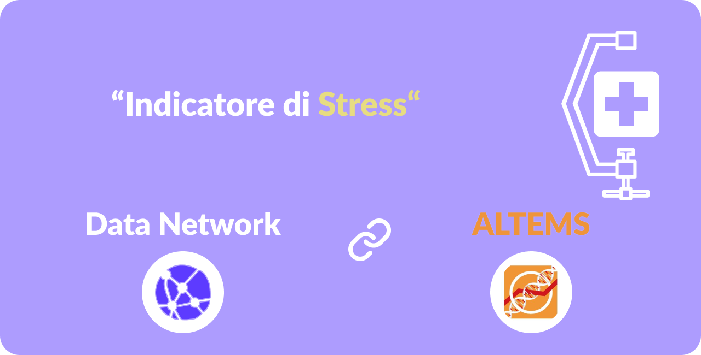

<!-- README.md is generated from README.Rmd. Please edit that file -->
<!-- Add banner here -->

<!-- badges: start -->

<!-- badges: end -->
<!-- Describe your project in brief -->

## Description

The project is articulated into 3 parts:

-   set new KPI
-   **etl** pipeline
-   data visualizations & frontend

the new KPI will be measuring the overall *stress* of our SSN (Servizio
Sanitario Nazionale) which is the results of a combination of the
**vaccination** and hospital **saturation** effects according to most
recent orders (D.L. 52/2021). This presumably will help to readjust the
thresholds set prior the vaccination campaign and ultimately might give
an updated perspective of the actual and future situation.

then the **etl pipeline** joins and cleans up data from these 3 sources:

-   [pcm-dpc, dati
    regioni](https://raw.githubusercontent.com/pcm-dpc/COVID-19/master/dati-regioni/dpc-covid19-ita-regioni.csv)
-   [pcm-dpc, dati statistici di
    riferimento](https://raw.githubusercontent.com/pcm-dpc/COVID-19/master/dati-statistici-riferimento/popolazione-istat-regione-range.csv)
-   [COVID 19 open data vaccini, somministrazioni
    vaccini](https://raw.githubusercontent.com/italia/covid19-opendata-vaccini/master/dati/somministrazioni-vaccini-latest.csv)

In the end visualization (maps, barcharts & arrowplots) are made with
[Datawrapper](https://www.datawrapper.de/) and nested within a simple
frontend:

## Demo-Preview

<!-- Add a demo for your project -->
in progres…

## Table of contents

Here there is a brief overview about the project, a more indeep
explanation of resuls and methodologies is offered in the [project
documentation](https://altems-documentation.netlify.app/) (under
maintenance)

-   [Project Title](#project-title)
-   [Demo-Preview](#demo-preview)
-   [Table of contents](#table-of-contents)
-   [Installation](#installation)
-   [Usage](#usage)
-   [Development](#development)
-   [Contribute and Conduct](#contribute-and-conduct)
    -   [Sponsor](#sponsor)
    -   [Adding new features or fixing
        bugs](#adding-new-features-or-fixing-bugs)
-   [License](#license)
-   [Footer](#footer)

# Installation

[(Back to top)](#table-of-contents)

*You might have noticed the **Back to top** button(if not, please
notice, it’s right there above!). This is a good idea because it makes
this README **easy to navigate.*** If you are willing to install this
project on your machine the recommendend choice is to git pull it from
github:

`git init`

`git clone https://github.com/navendu-pottekkat/nsfw-filter.git`

## Usage

[(Back to top)](#table-of-contents)

The whole repository data as well as cleaning process can be utilized
under the license prescription.

## Contribute and Conduct

[(Back to top)](#table-of-contents)

Please note that the indicatore\_zona\_gialla project is released with a
[Contributor Code of
Conduct](https://contributor-covenant.org/version/2/0/CODE_OF_CONDUCT.html).
By contributing to this project, you agree to abide by its terms.

## Sponsor

[(Back to top)](#table-of-contents)

The project sponsor is **ALTEMS** but if your are planning to support
our work as well feel free to tap the button and donate. If you are
interested to be contacted for future works or collaboration please feel
free too to PM us @ <datanetworkxyz@gmail.com>

<!-- Add the footer here -->

