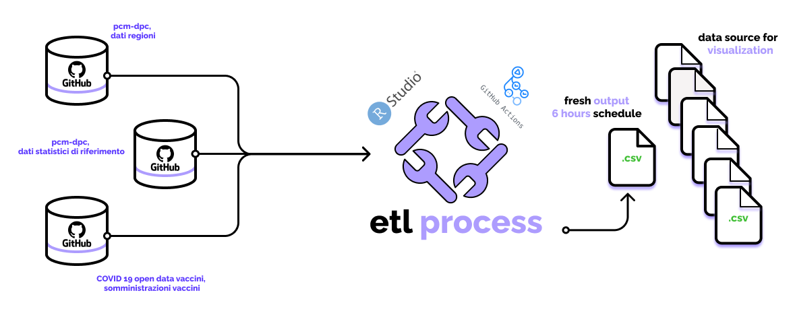

<!-- README.md is generated from README.Rmd. Please edit that file -->
<!-- Add banner here -->


<!-- badges: start -->

[](https://github.com/Data-Network-Lab/indicatore_zona_gialla/actions/workflows/main.yml)


[](https://github.com/Data-Network-Lab/indicatore_zona_gialla/network)


<!-- badges: end -->

## [Table of contents](#table-of-contents)

Here there are a few topics covered within this repo. A more indeep
explanation of resuls and methodologies as well as the tech stack is offered in the [project
documentation](https://altems-documentation.netlify.app/) _under
major revision_

-   [Description](#description)
-   [Demo Preview](#demo-preview)
-   [Installation](#installation)
-   [Usage](#usage)
-   [Contribute and Conduct](#contribute-and-conduct)
-   [Sponsors](#sponsor)
-   [License](#license)


## Description

[(Back to top)](#table-of-contents)

<!-- Describe your project in brief -->

The project is articulated into 3 parts:

-   create a new KPI i.e. Indicatore di Stress Regionale
-   articulated **ETL** (Extraction, Trasnformation & Loading) pipeline sourcing and merging (then computing Indicatore di Stress) 3 data Sources
-   visualize & builf frontend with [DataWrapper])(https://www.datawrapper.de/) on the aggregated data

the newly created Indicatore di Stress will be measuring the overall *stress* of our SSN (Servizio
Sanitario Nazionale) which is the results of a combination of the
**vaccination** and **incidence** effect per region. Both of the 2 dimensions can reflect hospital **saturation** and define
criteria according to which regions are put into either yellow, organge or red zones (_Zona Gialla_, _Zona Arancione_ e _Zona Rossa_) in compliance with the most
recent orders (D.L. 52/2021). This presumably will help decision makers to adjust the
obsolete thresholds set prior the vaccination campaign and ultimately might give a neat undestranding of the current situation and
an **updated perspective** on the future scenarios.

The **etl pipeline** joins and cleans up 3 data sources:

-   [pcm-dpc, dati
    regioni](https://raw.githubusercontent.com/pcm-dpc/COVID-19/master/dati-regioni/dpc-covid19-ita-regioni.csv)
-   [pcm-dpc, dati statistici di
    riferimento](https://raw.githubusercontent.com/pcm-dpc/COVID-19/master/dati-statistici-riferimento/popolazione-istat-regione-range.csv)
-   [COVID 19 open data vaccini, somministrazioni
    vaccini](https://raw.githubusercontent.com/italia/covid19-opendata-vaccini/master/dati/somministrazioni-vaccini-latest.csv)

Data is extracted, cleanded and aggregated every **6 hours**. At the end of the pipeline within the **./data** folder the output file is written in a .csv format.
Methodology and software choices are outlined in the documentation which is currently under _major revision_




Visualizations (barcharts, arrowplots, custom tables and more) are made with 
[Datawrapper](https://www.datawrapper.de/) whose data source points to the urls at **./data/data-graph**.


## Demo-Preview

[(Back to top)](#table-of-contents)

<!-- Add a demo for your project -->

in progress…
<p align="center">

</p>


## Installation

[(Back to top)](#table-of-contents)

*You might have noticed the **Back to top** button(if not, please
notice, it’s right there above!). This is a good idea because it makes
this README **easy to navigate.*** If you are willing to install this
project on your machine the recommendend choice is to git pull it from
github:

`git init`

`git clone https://github.com/Data-Network-Lab/indicatore_zona_gialla.git`

Then once you have cloned this repo on your machine you might execute:

``` r
if(!require(renv)){
    install.packages("renv")
}

renv::restore()
```

**Author Disclaimer**: `renv` is *not* a panacea for reproducibility, as
many people believe. Reproducible projects can be made easier with this
tool, which records the versions of R + R packages being used in a
project and provides tools for reinstalling those packages in a project
to their declared versions.

## Usage

[(Back to top)](#table-of-contents)

The whole repository data as well as cleaning process can be utilized
under the license prescription.

## Contribute and Conduct

[(Back to top)](#table-of-contents)

Please note that the indicatore\_zona\_gialla project is released with a
[Contributor Code of
Conduct](https://contributor-covenant.org/version/2/0/CODE_OF_CONDUCT.html).
By contributing to this project, you agree to abide by its terms.

## Sponsors

[(Back to top)](#table-of-contents)

The project sponsor is **ALTEMS** but if your are planning to support
our work as well feel free to tap the button and donate. If you are
interested to be contacted for future works or collaboration please feel
free too to PM us @ <datanetworkxyz@gmail.com>

## License

[(Back to top)](#table-of-contents)

Please visit the LICENSE.md file.

<!-- Add the footer here -->


