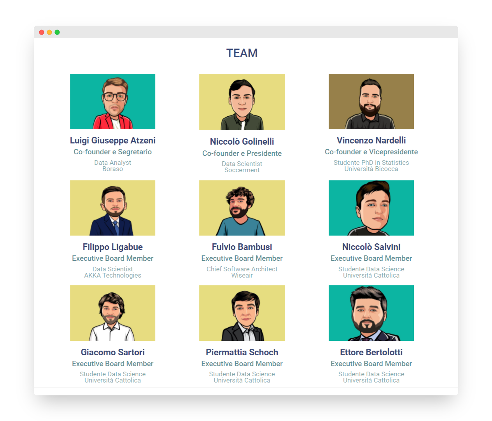
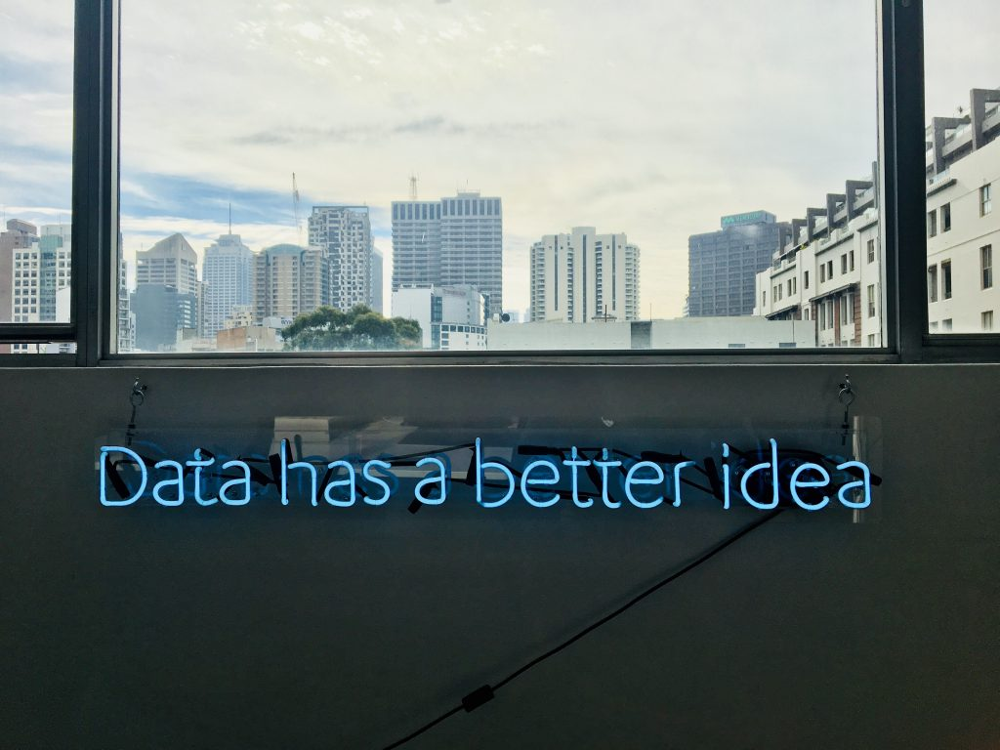

# Data Network

Be aware that this documentation ics currently under development, the vast majority of the parts need a review.

## Chi siamo

**DataNetwork** è un'associazione _no-profit_ che connette Data Scientists, Data Analysts, Data Journalists... in tutta Italia. Il retaggio di ciascuno di nostri soci, che sia universitario, esperenziale, lavorativo o personale riflette il modello mentale tramite cui questi, in maniera differente, approcciano un medesimo problema. Chi fa parte della community di Data Network, in questo senso, crede che diversi pareri siano meglio di un solo parere e che più un problema è affrontato da diverse angolazioni e meglio è compreso.
Questi semplici concetti, racchiusi nelle parole di Alfabetizzazione dei dati (Data Literacy) and (Democariazie dei dati) Data Democracy, stanno alla base della piramide dei valori di Data Network e di un mondo che vuole avvantaggiarsi dei dati, non confondersi fra di essi ([infodemia](https://www.treccani.it/vocabolario/infodemia_%28Neologismi%29/)).

[Visita il sito](https://datanetwork.xyz/) per inviare la candidatura 

<!-- 
 -->
<!--   <h2> -->
<!--      -->
<!--        -->
<!--       Hello Goodbye -->
<!--      -->
<!--   </h2> -->
<!-- 
 -->

## Cosa facciamo

**DN** nella sua parte promozionale organizza eventi a tema "dati" nell'area di Milano e presto in remoto offrendo corner talks di esperti e figure più Junior provenienti da ogni settore. Data Network può essere anche il luogo di presentazione della propria start-up, adatto alla ricerca di collaboratori esterni e consigli da esperti già operanti nella area strategica d'affari.
Data Network vanta collaborazioni con una multitudine di Stakeholders provenienti da varie industrie: dalle telecomunicazioni, ai servizi di streaming, a forti connessioni con società di management consulting, per arrivare a giganti corporate. 
La comunità proattiva di data network è sempre pronta a nuove sfide e recentemente è stato composto un team per partecipare ad Hackatons e competizioni a tema codice e dati.

## **Data Network** match

Una funzione esclusiva a cui i soci hanno accesso è il Data Network Match. DN match è uno strumento di ricerca semplice e intuitivo tramite il quale studenti, professionisti e aziende potranno contattare e ricercare i profili più in linea con le proprie esigenze. Non è mai stato così semplice trovare professionalità di valore e data literate per un nuovo progetto. Alcuni altri scopi:

- le esperienze vengono condivise
- la ricerca di un collaboratore per progetti interni o esterni sia facile e veloce
- il contatto diretto con stakeholders delle realtà partners di DN 
  

## Un po' di storia recente

...